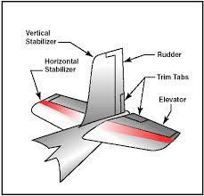

# Empennage (Tail Section)

# What is the Empennage?
The empennage is the tail section of an aircraft.  
Its primary function is to provide stability and control during flight.

Without the empennage, an aircraft would be difficult or impossible to control.

# Main Parts of the Empennage

# Horizontal Stabilizer
The horizontal stabilizer controls *pitch*, which is the up-and-down movement of the aircraft’s nose.

It works together with the *elevator* to:
- raise the nose
- lower the nose
- maintain steady flight

# Vertical Stabilizer
The vertical stabilizer controls *yaw*, which is the left-and-right movement of the aircraft’s nose.

It works together with the *rudder* to:
- maintain directional stability
- counteract side forces such as crosswinds

# Why the Empennage is Important
From an engineering perspective, the empennage:
- keeps the aircraft stable
- prevents unwanted rotations
- allows smooth and controlled maneuvering

It acts like the *feathers of an arrow*, keeping the aircraft pointed in the correct direction.

# Safety and Stability
The empennage is designed with high safety margins.  
Even small failures can seriously affect control, so redundancy and strong materials are used.

> Stability is just as important as lift.  
> The empennage ensures that the aircraft flies smoothly and predictably.
